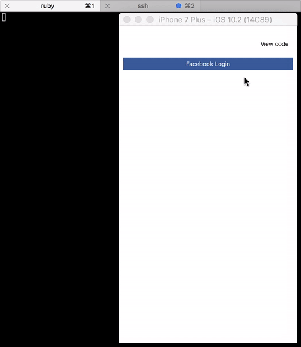

# Jasonette Facebook Login

[](https://travis-ci.org/snada/jasonette-facebook-login) [](https://codeclimate.com/github/snada/jasonette-facebook-login) [](https://codeclimate.com/github/snada/jasonette-facebook-login/coverage) [](https://codeclimate.com/github/snada/jasonette-facebook-login)


This is a sample app to illustrate the $oauth feature of [Jasonette](http://jasonette.com/), using Facebook as OAuth provider.

The backend acts as JSON provider for the Jasonette client app running on a mobile device, and also contains a protected API endpoint to demonstrate how to restrict data access to authenticated users only.

This is a Ruby on Rails 5 api mode app.



## Install

Clone this repo, navigate to it's folder and run

```
bundle install
```

Take a look at the config folder: you'll find a `database.yml.example`: clone it and rename it `database.yml`, modify it according to your system setup.

Then run:

```
bundle exec rails db:migrate
```

This version was tested using ruby version 2.3.0, but it should be simple enough to run safely against other versions.

## Setup

Go to [Facebook's developer portal](https://developers.facebook.com/) and create a new [web app](https://developers.facebook.com/quickstarts/?platform=web).

Return to this project folder, and clone the `.env.example` file: rename it to `.env` and edit it so that it contains your Facebook app id and secret token.

Go to your new app dashboard, and add Facebook login support to it. Add this callback uri to the setup:

```
http://{your_local_machine_network_address}:3000/callback
```

Configure your Jasonette client to listen to the same address, and the setup is done.

```
http://{your_local_machine_network_address}:3000
```

The application will redirect the device browser to this custom url scheme:

```
jasonettefblogin://
```

Configure your app accordingly!

## Run

Start the server with:

```
bundle exec rails server -b 0.0.0.0
```

Launch your Jasonette client on a iOS device/emulator (or simply run [jason](https://jasonette.github.io/documentation/jason/)), and see the login process in action.

## Test

This code uses rspec for testing.

Navigate the spec folder to take a closer look at the calls made by the system, and see the tests pass by running:

```
bundle exec rake
```

Also, a simple code coverage is in place, just navigate the `coverage` folder once the above command finished.

## Production notes

Of course, if you ever need to run a system like this in production remember to only exchange tokens via secure connections to be fully OAuth 2 compliant.
